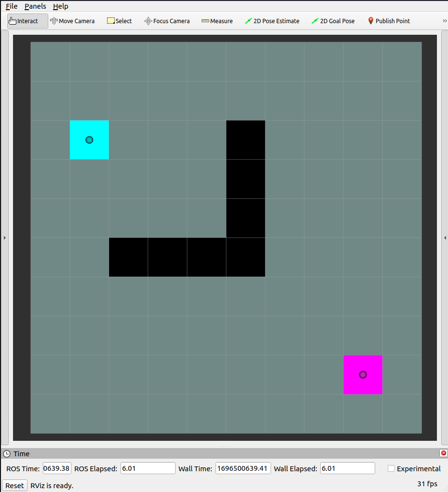

# Path-Planning-Algorithms-with-ROS2

<details open="open">
  <summary>Table of Contents</summary>
  <ol>
    <li><a href="#About">About</a></li>
    <li><a href="#Description-of-Algorithms">Description of Algorithms</a></li>
    <li><a href="#Using-this-Project">Using this Project</a></li>
  </ol>
</details>


**ToDo:**

- Potential function for the complex algo 
    - Explore neighbors
        - Takes a node and returns all its neighbor
- Should this be encapsulated in base Algorithm class?

<!-- refer for psudocode
https://www.youtube.com/watch?v=KiCBXu4P-2Y&list=PLDV1Zeh2NRsDGO4--qE8yH72HFL1Km93P&index=6 -->


## About

### Design aspects of system

Preliminary data such as map with obstacle, initial and goal position, common to all algorithms will be provided with node - `map_node`

Each algorithms can be executed using its own python node.

Complex algorithms which requires functionalities present in simpler can be derived easily as the codebase it OOP based.

<p align="center">
	<b>PlayGround</b>
</p>
<p align="center">
	
</p>


**bringup.launch.py**

```python
Launches rviz2 for visualization of algorithms and 
         map_node which provided the preliminary data
```

**map_node**

```python
Has the preliminary map defined.
Publishes 
    Map with obstacles
    initial and goal pose embedded within the map

    map data is first stored in 2d matrix represented as x, y

Instead of adjacency list, the preliminary map is transmitted.
    
Serves service `get_map` requested by individual algorithms for preliminary map.
Since this wont be changing over time and will be required only once service has been used,
instead of topic.
```

**algo_nodes**

```python
Waits for the GetMap service and requests the service for map with obstacles with initial and goal pose.
Instead of using sync service, using a flag to wait for the response.

Service callback method converts the data into 2D matrix for manipulation.

Within the timer loop BFS traversal is performed and each node is marked visited denoted in the map itself. 
After each iteration of master loop color of visited cells is increased in spectrum for visualization.

Path is back tracked using `parent` attribute and path is generated.
```


### Color Scheme of CostMap: 

```python
-128 to -2 => RED to YELLOW
-1         => GREY
0          => BLACK
1 to 98    => BLUE to RED
99         => CYAN
100        => PINK
101 to 127 => GREEN
```

```python
YELLOW => START POINT
BLUE   => END POINT
GREEN  => GENERATED PATH
Explored area has a gradient from YELLOW to BLUE for each iteration.
```

## Algorithms

### Fundamentals

<p align="center">
	<b>Breadth First Search</b>
</p>

<p align="center">
	
</p>


```python
Explores the neighbor nodes first, before moving to the next level of neighbors.
Utilizes queue to store the node yet to be visited.
```
<p align="center">
	<b>Depth First Search</b>
</p>

```python
Plunges depth first into a graph without regard for which edge it take next
until it cannot go further at which point it backtracks and continues.
```

<p align="center">
	<b>Minimal Spanning Tree</b>
</p>


### Grid-based search algorithms
- dijkstra
- greedy
- A*
- D*
- Uniform Cost Search
- Best-First Searching
- A*
- Bidirectional A*
- Anytime Repairing A*
- Learning Real-time A* (LRTA*)
- Real-time Adaptive A* (RTAA*)
- Lifelong Planning A* (LPA*)
- Dynamic A* (D*)
- D* Lite
- Anytime D*
-  Dynamic Window Approach.

### Sampling-based search algorithms
- Rapidly-Exploring Random Trees RRT
- RRT*
- Probabilistic Roadmap (PRM)
- RRT
- RRT-Connect
- Extended-RRT
- Dynamic-RRT
- RRT*
- Informed RRT*
- RRT* Smart
- Anytime RRT*
- Closed-Loop RRT*
- Spline-RRT*
- Fast Marching Trees (FMT*)
- Batch Informed Trees (BIT*)

### Potential Field Algorithms

- Artificial Potential Field (APF)

### Cell Decomposition Algorithms:

- Voronoi Diagrams
- Visibility Graphs: 

## Optimal Control Algorithms:

- Trajectory Optimization
- Model Predictive Control (MPC)

### Search-Based Algorithms:

 -Probabilistic Graph Search
- Anytime Algorithm

### Sampling-Based Hybrid Methods:

- PRM* (Probabilistic Roadmap Star)
- Informed RRT*

## Using this Project

Move into your workspace's src folder
```
cd ~/ros2_ws/src
```
Clone the project
```
git clone
```
Build the project.
```
cd ~/ros2_ws && colcon build
```

Launch rviz2 and map_node using bringup launch file
```
ros2 launch pathplanners bringup.launch.py
```

To see individual algorithms in action, run individual scripts.
```
ros2 run pathplanners <algorithm_name>
```

Executable list

```python
- bfs
```
Replace these with <algorithm_name> to run the specific algorithm


## SiteMap

```python
├── launch
│   └── bringup.launch.py
│
├── media
│   ├── bfs.gif
│   ├── bfs.webm
│   └── playground.png
│
├── pathplanners
│   ├── breadthfirstsearch.py
│   ├── __init__.py
│   ├── map.py
│
├── rviz
│   └── visualizer.rviz
│
├── README.md
│
├── package.xml
├── setup.cfg
└── setup.py

```