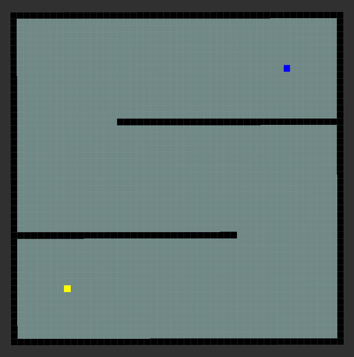

# Path-Planner-with-ROS2

<details open="open">
  <summary>Table of Contents</summary>
  <ol>
    <li><a href="#About">About</a></li>
    <li><a href="#Description-of-Algorithms">Description of Algorithms</a></li>
    <li><a href="#Using-this-Project">Using this Project</a></li>
  </ol>
</details>

<p align="center">
	<b>PlayGround</b>
</p>
<p align="center">
	
</p>


TO Do:
Store previously visited node and draw the path

<!-- refer for psudocode
https://www.youtube.com/watch?v=KiCBXu4P-2Y&list=PLDV1Zeh2NRsDGO4--qE8yH72HFL1Km93P&index=6 -->


## About

### Design aspects of system

**bringup.launch.py**

```python
Launches rviz2 and map_node
```

**map_node**

```python
Publishes 
    Map with obstacles
    initial and goal pose embedded within the map

    map data stored is first stored in 2d matrix represented as x, y

    Instead of adjacency list sharing the reference map data via
    GetMap service within the nav_msgs package
```

**algo_nodes**

```python
Waits for the GetMap service and requests the service for map with obstacles with initial and goal pose.
Not using sync service, but instead using a flag to wait for the response.

Service callback method converts the data into 3D matrix for manipulation.

Within the timer loop BFS traversal is performed and each node is marked visited denoted in the map itself. After each iteration of master loop color of visited cells is increased in spectrum for visualization.
```

### Color Scheme of CostMap: 

```python
-128 to -2 => RED to YELLOW
-1 => GREY
0 => BLACK
1 to 98 => BLUE to RED
99 => CYAN
100 => PINK
101 to 127 => GREEN
```

## Description of Algorithms

### Fundamentals


<p align="center">
	<b>Breadth First Search</b>
</p>
<p align="center">
	
</p>

- Depth First Search

### Grid-based search algorithms
- dijkstra
- greedy
- A*
- D*
- Uniform Cost Search

### Sampling-based search algorithms
- Rapidly-Exploring Random Trees RRT
- RRT*
Probabilistic Roadmap (PRM)

### Potential Field Algorithms

- Artificial Potential Field (APF)

### Cell Decomposition Algorithms:

- Voronoi Diagrams
- Visibility Graphs: 

## Optimal Control Algorithms:

- Trajectory Optimization
- Model Predictive Control (MPC)

### Search-Based Algorithms:

 -Probabilistic Graph Search
- Anytime Algorithm

### Sampling-Based Hybrid Methods:

- PRM* (Probabilistic Roadmap Star)
- Informed RRT*

## Using this Project

Move into your workspace's src folder
```
cd ~/ros2_ws/src
```
Clone the project
```
git clone
```
Build the project.
```
cd ~/ros2_ws && colcon build
```

Launch rviz2 and map_node using bringup launch file
```
ros2 launch pathplanners bringup.launch.py
```

To see individual algorithms in action, run individual scripts.
```
ros2 run pathplanners <algorithm_name>
```

Executable list
- bfs

Replace these with <algorithm_name> to run the specific algorithm

